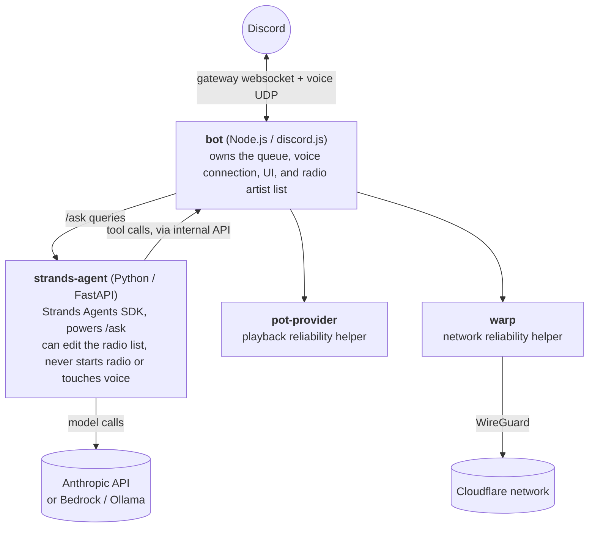

# DJ Tyga

A Discord music bot that streams YouTube audio into a voice channel. Slash commands, a
Now Playing card with buttons, and an optional natural-language assistant for queue
management.

```
/play Kanye West Ultralight Beam
/ask queue up 10 popular kanye songs from 2016
/radio add Kendrick Lamar
/radio on
```

## Contents

- [Features](#features)
- [Commands](#commands)
- [How it works](#how-it-works)
- [Getting started](#getting-started)
- [Configuration reference](#configuration-reference)
- [Security](#security)
- [Deploying to AWS](#deploying-to-aws)
- [Troubleshooting & operational notes](#troubleshooting--operational-notes)
- [Project layout](#project-layout)
- [Legal](#legal)

## Features

**Playback**
- Search, direct video links, or full playlists via `/play`
- Add, remove, reorder, shuffle, loop (off / track / queue)
- Skip, pause, resume, stop, with no noticeable join or stream latency

**Interactive UI**
- Every track auto-posts a Now Playing card: thumbnail, title, progress bar, requester,
  loop state, with buttons for pause/resume, skip, shuffle, and loop. No Stop button; see
  [Commands](#commands) for why.
- `/queue` is a paginated, button-navigable embed
- Older cards grey out their buttons once superseded, so only one card stays live per server

**Natural language**
- `/ask <anything>` runs a Claude agent (via [AWS Strands Agents](https://strandsagents.com))
  against the same queue every slash command uses: "queue up some upbeat 2016 songs",
  "remove everything", "move the last song to play next"
- `/radio` keeps a continuous flow of songs from a saved-per-server artist list
  (`/radio add`/`remove`/`list`). Starting it is plain YouTube search, not LLM-driven, so
  it plays music within a couple of seconds. It never locks the queue: clear it, shuffle
  it, `/play` something unrelated, whatever. Whenever the queue runs low it tops up from
  the artist list, up to 15 tracks at a time, for as long as radio stays on.
  `/radio add`/`remove` each act once: add shuffles that artist's songs in immediately if
  radio is on; remove drops their not-yet-played queued songs.
- Both are optional. Every slash command works with zero LLM involvement, and the
  assistant is scoped to a fixed, audited tool set (see
  [Security](#security)).

## Commands

| Command | Description |
|---|---|
| `/play <query-or-url>` | Search term, video URL, or playlist URL. Joins your voice channel and queues it; plays immediately if idle. |
| `/pause` | Pause the current track. |
| `/resume` | Resume a paused track. |
| `/skip` | Skip the current track. |
| `/stop` | Stop playback and clear the queue. Leaves the voice channel, unless 24/7 mode is on (see below). |
| `/leave` | Leave the voice channel. |
| `/queue` | Show the queue, now playing plus upcoming, paginated. |
| `/nowplaying` | Show the current track as a live control card. |
| `/remove <index>` | Remove a track from the queue by position. |
| `/shuffle` | Shuffle the upcoming queue. |
| `/loop <off\|track\|queue>` | Set the loop mode. |
| `/247` | Toggle 24/7 mode: stay connected through an empty queue (see below). |
| `/ask <query>` | Plain-language queue control. *(needs an LLM provider configured)* |
| `/radio on [artist]` | Start radio from your saved rotation, optionally adding one artist first. |
| `/radio off` | Turn off radio mode; finishes what's queued, then stops. |
| `/radio add <artist>` / `/radio remove <artist>` | Edit the rotation. |
| `/radio list` | Show the current rotation. |

The Now Playing card covers pause/resume, skip, shuffle, and loop: the actions worth a
single click. `/stop` clears the queue and disconnects, and `/ask` handles anything harder
to express as a button ("skip the next three songs", "move that to the front"). Both stay
commands rather than buttons on purpose.

`/247` swaps the normal empty-queue timeout for a longer one that only checks whether
anyone else is in the channel. The bot stays connected through an empty queue and leaves
only when a human disconnects it (`/leave`, or `/247` again) or the channel sits empty for
over an hour (`ALONE_TIMEOUT_MS`). `/stop` during 24/7 mode doesn't count as that manual
disconnect: it stops playback and clears the queue, same as always, and the bot stays put.

`/radio`'s artist list is per-server and survives restarts (stored under `data/`, not
in-memory queue state), so build it up over time regardless of whether radio is playing.
It's plain YouTube search, no LLM. `/ask` can edit the same list in plain English ("add
some Kendrick to the radio") through three narrow tools; it still can't start radio or
touch voice itself, same boundary as everything else the assistant does (see
[Security](#security)).

## How it works



Three containers always running, plus `warp`, which is optional (on by default). Every
internal port is compose-internal only. Nothing but Discord, Cloudflare (if `warp` is
enabled), and (if configured) Anthropic's API is reachable from outside.

**A single track, end to end.** `/play` resolves the query via `yt-dlp`, joins the voice
channel, and hands YouTube's audio to Discord. Most audio is already Opus in a WebM
container, so it's demuxed directly with no transcoding; `ffmpeg` is a fallback for the
rare format that isn't. The next queued track's stream resolves one track ahead in the
background, so skips and transitions feel instant.

**Why free-text search prefers songs over videos.** Plain YouTube search for an artist or
game often surfaces the most-viewed video for that term: a boss-fight recording, a
let's-play, a reaction video. Every search here (`/play`, `/radio`, `/ask`'s search tools)
queries YouTube Music's own catalog first, its "Songs" section then "Videos," falling back
to regular YouTube search only if neither has anything. YouTube Music's index only
contains music, so non-music video has no path to surface. See `searchYoutube` in
`src/music/resolve.js`.

One trade-off: YouTube Music's search listing doesn't carry duration up front. `/play`
backfills it with one extra extraction of the chosen result, the same cost it always paid,
so the "Added to queue" card shows a real duration right away. Bulk results (radio's pool,
`/ask`'s search tools) skip that extra round trip to stay fast, showing "Live/Unknown"
until the track is about to play, at which point `getStreamInfo` resolves it anyway (and
one track ahead, via prefetch) and backfills duration for free.

**Playing reliably from a server.** `pot-provider` solves YouTube's PO-token challenge and
should always run; there's no reason to disable it. `warp` is different: it's an optional,
best-effort attempt to get around YouTube blocking cloud-provider IP ranges, by tunneling
out through Cloudflare's network instead of the host's own. It helps, but Cloudflare's free
WARP IPs are a shared pool used by lots of people running exactly this kind of automated
traffic, and the pool's reputation degrades under sustained use — so under heavy load it can
stop helping entirely, and no amount of retrying or reconnecting fixes that. **If you have a
real residential IP** (running this on a home connection) **or a paid residential/static
proxy, that's more reliable than `warp` and worth using instead.**

**Enabling/disabling `warp`.** On by default: `docker compose up` starts all four
containers. To run without it instead:

```bash
docker compose -f docker-compose.yml -f docker-compose.no-warp.yml up --build --no-deps bot pot-provider strands-agent
```

`docker-compose.no-warp.yml` points `YTDLP_PROXY_URL`/`AUDIO_PROXY_URL` at whatever you've
set in `.env` (blank by default, meaning talk to YouTube directly — the right choice on a
residential connection, or set them to your own proxy's address first). `--no-deps` matters:
Compose merges `depends_on` across files rather than letting an override remove entries from
it, so without `--no-deps`, `warp` starts anyway as a declared dependency of `bot` even with
the override applied and even naming services explicitly — `--no-deps` is what actually
stops Compose from resolving and starting it.

**Why the voice connection needs `@discordjs/voice` 0.19+.** Discord enforces its DAVE
end-to-end encryption on all voice calls now. An older client's connection closes silently
the moment it tries to stream, well after login and REST calls succeed. See
[Troubleshooting](#troubleshooting--operational-notes) for the failure signature.

**Why `/ask` and `/radio` are architected differently.** `/ask` needs real reasoning:
picking specific songs, deciding what "high energy" means, chaining tool calls. `/radio`
needs to start playing music in a couple of seconds; a bulk search per rotation artist does
that, and routing it through an LLM agent was tried first and was too slow. The two meet at
the radio artist list itself, small enough state that the agent can mutate it through three
narrow tools without reasoning about playback. Both call the same `GuildQueue` the slash
commands use, so there's one source of truth regardless of which interface touched it.

## Getting started

### 1. Create the Discord application

1. Go to the [Discord Developer Portal](https://discord.com/developers/applications),
   click **Create App**, and name it.
2. On **General Information**, copy the **Application ID**: this is `DISCORD_CLIENT_ID`.
3. Click **Bot**, click **Reset Token**, and copy the token immediately (shown once): this
   is `DISCORD_TOKEN`. Leave **Privileged Gateway Intents** off; nothing here needs them.
4. Click **Installation**. Under **Guild Install**, set scopes to `bot` and
   `applications.commands`. In **Permissions**, check exactly: `View Channels`,
   `Send Messages`, `Embed Links`, `Use Slash Commands`, `Connect`, `Speak`. Nothing more.
   `Embed Links` matters: every reply is a rich embed, and without it Discord drops them
   silently.
5. Copy the **Install Link**, open it, pick your server, and **Authorize** (needs Manage
   Server on that server).

### 2. Configure

```bash
cp .env.example .env
```

Fill in `DISCORD_TOKEN` and `DISCORD_CLIENT_ID`. For development, also set
`DISCORD_GUILD_ID` to your server's ID so slash commands register instantly instead of
waiting up to an hour for global propagation. Leave it blank once you're running on
multiple servers.

### 3. Run locally with Docker (recommended)

```bash
docker compose up --build
```

Runs the bot with `pot-provider` and `strands-agent`, the same setup as production.

### 4. Run locally without Docker

Requires Node.js 22+, Python 3.12+, and ffmpeg on your PATH.

```bash
pip install "yt-dlp[default]" bgutil-ytdlp-pot-provider
npm install
```

Start the pot-provider sidecar in one terminal:

```bash
docker run --rm -p 4416:4416 brainicism/bgutil-ytdlp-pot-provider:latest
```

Start the bot:

```bash
npm start
```

To run `/ask` locally without Docker (`/radio` doesn't need it), start the agent sidecar
in another terminal:

```bash
cd agent
pip install -r requirements.txt
ANTHROPIC_API_KEY=... BOT_INTERNAL_API_URL=http://127.0.0.1:8100 uvicorn app:app --port 8000
```

## Configuration reference

All variables live in `.env` (copy from `.env.example`).

| Variable | Purpose |
|---|---|
| `DISCORD_TOKEN`, `DISCORD_CLIENT_ID` | Bot credentials from the Developer Portal. |
| `DISCORD_GUILD_ID` | Optional. Instant command registration to one server during development; blank registers globally (~1hr propagation). |
| `YTDLP_PATH` | Path to the `yt-dlp` binary. Default `yt-dlp`. |
| `YTDLP_POT_PROVIDER_URL` | Where `pot-provider` is reachable. Compose overrides this automatically. |
| `YTDLP_PLAYER_CLIENTS` | Leave blank; let yt-dlp choose Innertube clients itself. |
| `YTDLP_PROXY_URL` | Optional network proxy for yt-dlp. Compose points this at `warp` automatically unless you use `docker-compose.no-warp.yml`; leave blank for local dev on a residential connection, or set your own residential/static proxy's address. |
| `AUDIO_PROXY_URL` | Optional proxy for the audio download step. Same rules as `YTDLP_PROXY_URL` above — keep them in sync. |
| `YTDLP_COOKIES_FILE` | Optional path to a cookies.txt, for age-restricted videos. Default `data/cookies.txt`; unset by default, needs no account. |
| `QUEUE_IDLE_TIMEOUT_MS` | How long an empty queue waits before the bot leaves voice. Default 5 minutes. |
| `ALONE_TIMEOUT_MS` | In 24/7 mode, how long the bot tolerates an empty channel before giving up. Default 1 hour. |
| `RADIO_STORE_PATH` | Where the `/radio` artist rotation is stored. Default `data/radio-artists.json`. |
| `STRANDS_AGENT_URL` | Base URL for the agent sidecar. Leave blank to disable `/ask` and `/radio`. |
| `INTERNAL_API_PORT` | Port the bot's internal queue API listens on (never published to the host). |
| `STRANDS_MODEL_PROVIDER` | `anthropic` (default), `bedrock`, or `ollama`. See `agent/model.py`. |
| `STRANDS_MODEL_ID` | Model id. Defaults to Claude Haiku for `anthropic`; required for `bedrock`/`ollama`. |
| `ANTHROPIC_API_KEY` | Required for the `anthropic` provider. |
| `ANTHROPIC_WORKSPACE_ID` | Only for an API key scoped to multiple workspaces. |
| `RADIO_DEFAULT_QUERY` | What `/radio` plays with no topic given. |
| `BOT_INTERNAL_API_URL` | (agent-side) Where the bot's internal API is reachable. Compose sets this automatically. |

## Security

`/ask` and `/radio`'s tools reach the bot through a small internal API, scoped to your
own server and never exposed outside the container network. The assistant works with a
fixed, limited set of queue and radio tools, nothing else, and has no way to join or leave
voice or start radio on its own; those stay human-triggered commands.

## Deploying to AWS

Discord's gateway websocket and voice UDP need a persistent connection, which rules out
Lambda/Fargate-style short-lived compute. This runs on a single self-healing EC2 instance
(an Auto Scaling Group pinned at 1) with zero inbound networking; every container only
makes outbound connections. CloudFormation-managed, with GitHub Actions handling routine
deploys via SSM. Templates, boot script, and the full runbook live in
[`infra/`](infra/README.md), kept separate from the app.

## Troubleshooting & operational notes

- **`@discordjs/voice` must be 0.19.x or newer.** Discord enforces DAVE end-to-end
  encryption on all non-stage voice calls. An unsupported client's voice connection closes
  with code 4017 ("E2EE/DAVE protocol required"), and everything looks like a normal join
  right up until then. `package.json` pins `^0.19.0`; don't downgrade it.
- **Keep yt-dlp current.** If extraction starts failing, first try
  `pip install -U "yt-dlp[default]" bgutil-ytdlp-pot-provider` (or rebuild the image)
  before investigating anything else.
- **yt-dlp needs a JS runtime.** It solves YouTube's JS challenge via `yt-dlp-ejs` plus an
  external runtime, Deno by default. We point it at Node (`--js-runtimes node` in
  `src/music/ytdlp.js`) since the bot already runs on Node 22+.
- **Don't pin `YTDLP_PLAYER_CLIENTS`.** An earlier version hardcoded `tv,web` and broke
  extraction when YouTube changed behavior for those clients. Leave it blank.
- **Extraction fails on a cloud host, or playback fails with "Failed to fetch audio
  stream (HTTP 403)" after resolution succeeds.** Confirm `warp` is connected:
  `docker compose logs warp` should show `StatusChanged(Connected ...)`. If it's connected
  and 403s still happen, especially in bursts after a lot of playback, that's the shared
  free WARP IP pool's reputation degrading under load, not a config problem — see
  "Enabling/disabling `warp`" above; a residential IP or a paid residential/static proxy
  fixes this reliably where `warp` can't. If neither explains it, check the yt-dlp
  [PO Token Guide](https://github.com/yt-dlp/yt-dlp/wiki/PO-Token-Guide).
- **Rootless Podman with a custom bridge network never reached `ready` on the voice
  connection**, separate from the DAVE issue above, when first tested on Bazzite. Running
  containers with `--network host` fixed it. `docker-compose.yml` still uses a normal
  bridge network since standard Docker Engine doesn't have the same issue.
- **"Identity-linked" Anthropic API keys need a workspace ID.** If `/ask` or `/radio` fail
  with an error mentioning `anthropic-workspace-id`, generate a key scoped to one
  workspace, or set `ANTHROPIC_WORKSPACE_ID`.
- **Age-restricted videos fail with "Sign in to confirm you're not a bot," even though
  everything else plays fine.** That content needs a real signed-in session, which a PO
  token doesn't provide. Drop a Netscape-format `cookies.txt` at `data/cookies.txt` (or
  point `YTDLP_COOKIES_FILE` elsewhere) to enable it; leave it unset to skip those tracks.
  Use a dedicated account for this, not a personal one: export with the
  [Get cookies.txt LOCALLY](https://chromewebstore.google.com/detail/get-cookiestxt-clean/ahmnmhfbokciafffnknlekllgcnafnie)
  extension from a private window right after logging in, and don't log out afterward or
  the exported session dies with it. Cookies expire in a few days, so this needs
  refreshing periodically; see [Deploying to AWS](infra/README.md) for how the AWS setup
  automates picking up a refreshed cookie file.

## Project layout

- **`src/index.js`**: bootstrap, client login, command registration, interaction routing
- **`src/commands/`**: one file per slash command
- **`src/music/`**
  - `GuildQueue.js`: per-guild queue and player state machine
  - `resolve.js`: yt-dlp wrapper, search, URL/playlist resolution, stream resolution
  - `audioResource.js`: builds a Discord audio resource
  - `ytdlp.js`: low-level yt-dlp subprocess wrapper, PO-token wiring
  - `queueManager.js`: guildId to `GuildQueue` registry
  - `radioStore.js`: persisted per-guild `/radio` artist list
  - `radioManager.js`: builds and tops up the radio queue
  - `shuffle.js`: shared Fisher-Yates shuffle
- **`src/discord/`**
  - `embeds.js`, `components.js`, `format.js`: embed and button UI builders
  - `buttonHandler.js`: routes Now Playing card clicks back into `GuildQueue`
- **`src/internal/`**
  - `api.js`: internal HTTP API the agent's tools call
  - `agentClient.js`: bot-side client for the strands-agent sidecar
- **`agent/`**: Python/FastAPI Strands Agents sidecar (`app.py`, `model.py`, `tools.py`,
  `interventions.py`)
- **`infra/`**: CloudFormation templates, boot script, and deployment runbook (see
  [Deploying to AWS](#deploying-to-aws)); `.github/workflows/` holds the two Actions that
  deploy it (GitHub only discovers workflows at that path)

## Legal

Not affiliated with, endorsed by, or connected to YouTube, Google, Discord, or Anthropic.

This is a general-purpose tool for personal, self-hosted use: playing publicly available
audio in a voice channel you control, the same way a browser tab would. It doesn't cache,
redistribute, or store any media; every stream is fetched fresh and discarded when it
ends. yt-dlp resolves a playable URL the same way a browser does; nothing here decrypts
or removes an access control on the underlying content.

This project doesn't operate a shared public instance. Each deployment is a separate
self-hosted copy, run by whoever set it up, for their own server. You're responsible for
complying with YouTube's, Discord's, and Anthropic's terms of service in how you run it,
and with the copyright law of your jurisdiction.

Licensed under [MIT](LICENSE). Provided as is, with no warranty.
