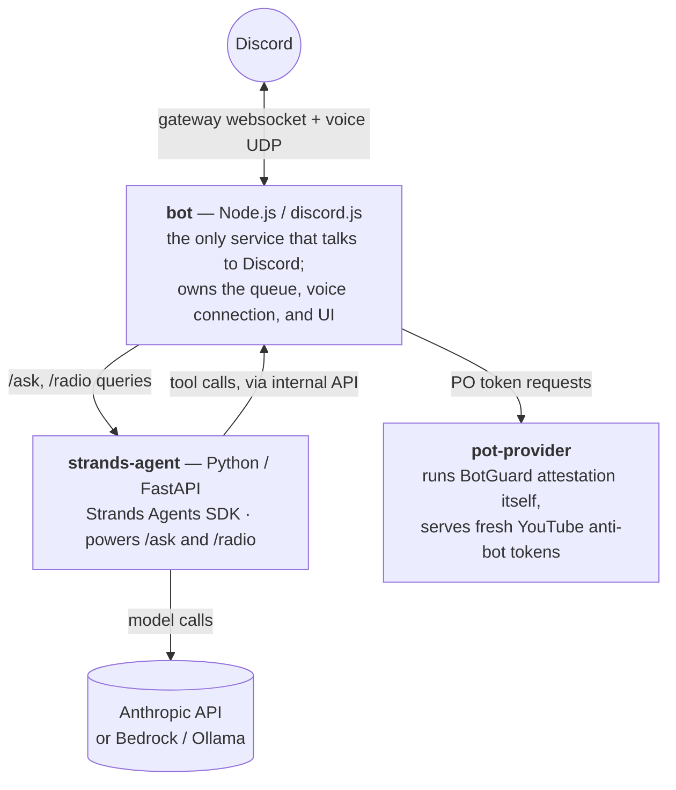

# 🎧 DJ Tyga

An interactive Discord music bot that streams YouTube audio into your voice channel —
controllable via classic slash commands, rich interactive "Now Playing" cards with
one-click buttons, and an optional natural-language assistant that manages the queue for
you in plain English.

```
/play Kanye West Ultralight Beam
/ask queue up 10 popular kanye songs from 2016
/radio 90s R&B
```

## Contents

- [Features](#features)
- [Commands](#commands)
- [How it works](#how-it-works)
- [Getting started](#getting-started)
- [Configuration reference](#configuration-reference)
- [Security: the natural-language assistant's boundaries](#security-the-natural-language-assistants-boundaries)
- [Deploying to AWS](#deploying-to-aws)
- [Troubleshooting & operational notes](#troubleshooting--operational-notes)
- [Project layout](#project-layout)

## Features

**Playback**
- Search, direct video links, or full playlists via `/play`
- Queue management: add, remove, reorder, shuffle, loop (off / track / queue)
- Skip, pause, resume, stop — instantly, with no noticeable join/stream latency

**Interactive UI, not just text**
- Every track that starts playing auto-posts a rich **Now Playing** card — thumbnail,
  title, a live progress bar, requester, and loop state — with buttons to
  pause/resume, skip, stop, shuffle, and cycle loop mode right from the message, no
  typing required
- `/queue` renders a paginated, button-navigable embed instead of a wall of text
- Older cards automatically grey out their buttons once superseded, so there's only ever
  one "live" control panel per server

**Natural language, when you want it**
- `/ask <anything>` — a real LLM agent (Claude, via
  [AWS Strands Agents](https://strandsagents.com)) interprets free-form requests
  ("queue up some upbeat 2016 songs", "remove everything", "move the last song to play
  next") and carries them out using the same queue every slash command uses
- `/radio [topic]` — starts an instant, continuously-shuffled rotation around a topic
  (an artist, genre, mood, era — or nothing, for a sensible default). This is
  deliberately **not** LLM-driven: it's a single fast YouTube search returning a large
  pool of results, because the goal is music playing in your ears in ~2 seconds, not a
  hand-curated playlist five round trips later
- Both are fully optional — every plain slash command works with zero LLM involvement,
  and the assistant is scoped to a fixed, audited set of queue-only tools (see
  [Security](#security-the-natural-language-assistants-boundaries))

## Commands

| Command | Description |
|---|---|
| `/play <query-or-url>` | Search term, video URL, or playlist URL. Joins your voice channel and queues it — plays immediately if idle. |
| `/pause` | Pause the current track. |
| `/resume` | Resume a paused track. |
| `/skip` | Skip the current track. |
| `/stop` | Stop playback, clear the queue, and leave the voice channel. |
| `/leave` | Leave the voice channel. |
| `/queue` | Show the queue — now playing plus upcoming, paginated with buttons. |
| `/nowplaying` | Show the current track as a live control-panel card (buttons included). |
| `/remove <index>` | Remove a specific track from the queue by position. |
| `/shuffle` | Shuffle the upcoming queue. |
| `/loop <off\|track\|queue>` | Set the loop mode. |
| `/247` | Toggle 24/7 mode — stay connected indefinitely instead of leaving on an empty queue (see below). |
| `/ask <query>` | Tell the bot what you want in plain language; the assistant figures out the tool calls. *(optional — needs an LLM provider configured)* |
| `/radio [query]` | Start a continuous shuffled rotation. No query = a configurable default topic. *(optional — needs an LLM provider configured, though it makes no LLM calls itself)* |

The "Now Playing" card's buttons cover pause/resume, skip, stop, shuffle, and loop —
everything the most common single-click actions need — while `/ask` covers anything
harder to express as a button, like "skip the next three songs" or "move that to the
front."

`/247` replaces the normal empty-queue idle timeout with a much longer one based on
whether anyone else is actually in the channel — the bot stays connected through an empty
queue indefinitely, and only leaves if a human manually stops it or the channel has had no
other members for over an hour (`ALONE_TIMEOUT_MS`). Running `/247` again turns it off and
restores the normal timeout immediately.

## How it works



Three containers, always running together. Every internal port (the bot's own API, the
agent's API, the pot-provider) is compose-internal only — nothing but Discord and (if
configured) Anthropic's API is ever reachable from outside.

**A single track, end to end:** `/play` resolves the query via `yt-dlp` (with an
automatically-supplied anti-bot token from `pot-provider` — see below), joins your voice
channel, and hands YouTube's audio straight to Discord. Most YouTube audio is already
Opus inside a WebM container, so it's demuxed directly with no transcoding step — the
`ffmpeg` path only kicks in as a fallback for the rare format that isn't already Opus.
The *next* queued track's stream is resolved one track ahead in the background, so
skipping and track transitions feel instant instead of pausing to resolve a URL.

**Why YouTube extraction needs help at all:** YouTube requires solving a JS challenge and
increasingly gates access behind a "Proof-of-Origin" token, especially from datacenter
IPs (which includes any cloud host, AWS included) — without it you get "Sign in to
confirm you're not a bot." The `pot-provider` sidecar runs the actual BotGuard
attestation itself and serves fresh tokens over a local API that `yt-dlp` calls
automatically. This is the standard, actively-maintained way bots solve this today —
**no browser cookie export, ever**, on this box or in production.

**Why the voice connection needs `@discordjs/voice` 0.19+:** Discord enforces its DAVE
end-to-end-encryption protocol on all voice calls now; an older client's connection gets
silently closed the moment it tries to actually stream, well after login/gateway/REST
calls all succeed normally. See [Troubleshooting](#troubleshooting--operational-notes)
for the full failure signature.

**Why `/ask` and `/radio` are architected differently:** `/ask` needs genuine reasoning
(picking specific real songs, deciding what "high energy" means, chaining several tool
calls) — that's the LLM's job, worth the latency. `/radio` needs to start playing music
in about two seconds — a single bulk YouTube search does that, and going through an LLM
agent for it was tried first and was simply too slow (many sequential search/tool round
trips to hand-curate 25+ songs). Both still just call the exact same `GuildQueue` the
slash commands use, so there's one single source of truth for what's actually playing no
matter which interface touched it.

## Getting started

### 1. Create the Discord application

1. Go to the [Discord Developer Portal](https://discord.com/developers/applications),
   click **Create App**, and name it.
2. On **General Information**, copy the **Application ID** — this is `DISCORD_CLIENT_ID`.
3. Click **Bot** in the sidebar, click **Reset Token**, and copy the token immediately
   (it's shown once) — this is `DISCORD_TOKEN`. Leave **Privileged Gateway Intents** off;
   nothing here needs them (everything is slash commands and button interactions, no
   message content access).
4. Click **Installation** in the sidebar. Under **Guild Install**, set scopes to `bot`
   and `applications.commands`. In the **Permissions** picker, check exactly:
   `View Channels`, `Send Messages`, `Embed Links`, `Use Slash Commands`, `Connect`,
   `Speak` — nothing more (no Manage anything, no moderation permissions).
   `Embed Links` matters: every reply is a rich embed, and without it Discord silently
   drops them.
5. Copy the **Install Link**, open it in a browser, pick your server, and **Authorize**
   (you need Manage Server there to add bots).

### 2. Configure

```bash
cp .env.example .env
```

Fill in `DISCORD_TOKEN` and `DISCORD_CLIENT_ID`. For development, also set
`DISCORD_GUILD_ID` to your server's ID so slash commands register instantly instead of
waiting up to an hour for global propagation — leave it blank once you're running on
multiple servers (see [Configuration reference](#configuration-reference)).

### 3. Run locally with Docker (recommended)

```bash
docker compose up --build
```

This runs the bot together with `pot-provider` and `strands-agent`, exercising the exact
same setup you'd run in production.

### 4. Run locally without Docker

Requires Node.js 22+, Python 3.12+, and ffmpeg on your PATH.

```bash
pip install "yt-dlp[default]" bgutil-ytdlp-pot-provider
npm install
```

Start the PO-token provider in one terminal:

```bash
docker run --rm -p 4416:4416 brainicism/bgutil-ytdlp-pot-provider:latest
```

Start the bot:

```bash
npm start
```

To also run `/ask` and `/radio` locally without Docker, start the agent sidecar in
another terminal:

```bash
cd agent
pip install -r requirements.txt
ANTHROPIC_API_KEY=... BOT_INTERNAL_API_URL=http://127.0.0.1:8100 uvicorn app:app --port 8000
```

## Configuration reference

All variables live in `.env` (copy from `.env.example`). Grouped by what they affect:

| Variable | Purpose |
|---|---|
| `DISCORD_TOKEN`, `DISCORD_CLIENT_ID` | Bot credentials from the Developer Portal. |
| `DISCORD_GUILD_ID` | Optional. Set for instant command registration to one server during development; leave blank to register globally (works on every server the bot is in, ~1hr propagation). |
| `YTDLP_PATH` | Path to the `yt-dlp` binary. Default `yt-dlp`. |
| `YTDLP_POT_PROVIDER_URL` | Where `pot-provider` is reachable. Compose overrides this automatically. |
| `YTDLP_PLAYER_CLIENTS` | Leave blank — let yt-dlp choose Innertube clients itself. See [Troubleshooting](#troubleshooting--operational-notes). |
| `QUEUE_IDLE_TIMEOUT_MS` | How long an empty queue waits before the bot leaves voice. Default 5 minutes. |
| `ALONE_TIMEOUT_MS` | In 24/7 mode (`/247`), how long the bot tolerates an empty channel before giving up anyway. Default 1 hour. |
| `STRANDS_AGENT_URL` | Base URL for the agent sidecar. **Leave blank to disable `/ask` and `/radio` entirely.** |
| `INTERNAL_API_PORT` | Port the bot's internal queue API listens on (never published to the host). |
| `STRANDS_MODEL_PROVIDER` | `anthropic` (default), `bedrock`, or `ollama` — see `agent/model.py`. |
| `STRANDS_MODEL_ID` | Model id. Defaults to Claude Haiku for `anthropic` (cheapest tier — plenty for this tool set); required explicitly for `bedrock`/`ollama`. |
| `ANTHROPIC_API_KEY` | Required if using the `anthropic` provider. |
| `ANTHROPIC_WORKSPACE_ID` | Only needed for an "identity-linked" API key scoped to multiple workspaces. |
| `RADIO_DEFAULT_QUERY` | What `/radio` plays with no topic given. Just a config value — change it any time. |
| `BOT_INTERNAL_API_URL` | (agent-side) Where the bot's internal API is reachable. Compose sets this automatically. |

## Security: the natural-language assistant's boundaries

The agent's tools (`agent/tools.py`) only reach the bot through a small internal HTTP API
(`src/internal/api.js`) that's never published outside the container network. Every route
is scoped per-guild, and the guild ID is fixed from the original Discord interaction —
never something the model can set itself, so even a successful prompt injection can't
redirect a tool call at another server.

The agent has exactly eleven tools — search, batch search, and queue
read/add/remove/move/clear/shuffle/skip/pause/resume/loop — and nothing else. No shell,
file, or generic HTTP/network tool is installed (`agent/requirements.txt` deliberately
omits `strands-agents-tools`, the package that would add those), and the agent is never
given `load_tools_from_directory=True`, so nothing beyond that fixed list is ever
reachable. It also has no way to join or leave a voice channel — that stays
human-triggered (`/play`, `/stop`, `/leave`).

**`add_tracks`'s `url` is validated, not just trusted.** The tool's docstring tells the
model to only use URLs from `search_youtube`, but a docstring is a suggestion, not a
boundary — nothing stops a hallucinated or prompt-injected URL from reaching it, and that
URL eventually gets handed to `yt-dlp` as a subprocess argument on the bot side, which is
a real SSRF-ish risk (`yt-dlp`'s generic extractor will fetch arbitrary URLs, including
internal-only services or a cloud metadata endpoint once deployed). This is enforced at
two independent layers:
1. A Strands `InterventionHandler` (`agent/interventions.py`), using the SDK's own
   `before_tool_call` policy hook to `Deny` the call before it executes and tell the
   model why — the framework-idiomatic "infrastructure decides, not the prompt" pattern.
2. A matching check in the bot's own internal API — the actual trust boundary, enforced
   regardless of what the agent process does, in case that process is ever compromised or
   buggy.

`add_tracks` is also capped server-side (25 tracks/call) regardless of what's requested.
Conversation memory is per-guild and lives only as long as the current queue session
does — it resets the moment the queue empties and the bot disconnects (`/stop`, idle
timeout, or a real external disconnect).

## Deploying to AWS

This is a persistent-connection workload (Discord gateway websocket + voice UDP), which
rules out Lambda/Fargate-style short-lived compute. The simplest fit is a small always-on
host — an EC2 or Lightsail instance running `docker compose up -d`. No inbound networking
is needed at all; every container only makes outbound connections.

## Troubleshooting & operational notes

- **`@discordjs/voice` must be on 0.19.x or newer.** Discord enforces its DAVE E2EE
  protocol on all non-stage voice calls now — a client that doesn't support it gets its
  voice connection closed immediately with close code 4017 ("E2EE/DAVE protocol
  required"), and everything *looks* like a normal join right up until that point
  (gateway login, REST calls, even the voice websocket's initial handshake all succeed).
  DAVE support landed in `@discordjs/voice` 0.19.0 via a bundled `@snazzah/davey`
  dependency; `package.json` pins `^0.19.0` for exactly this reason — don't downgrade it.
- **Keep yt-dlp current.** YouTube changes frequently; if extraction starts failing,
  first try `pip install -U "yt-dlp[default]" bgutil-ytdlp-pot-provider` (or rebuild the
  Docker image) before investigating anything else.
- **yt-dlp needs a JS runtime.** YouTube extraction requires solving a JS challenge;
  `yt-dlp` handles this via its `yt-dlp-ejs` component (bundled by the `[default]` extra)
  plus an external JS runtime — Deno by default, but we point it at Node
  (`--js-runtimes node` in `src/music/ytdlp.js`) since the bot already runs on Node 22+
  and there's no reason to add Deno as a second runtime just for this.
- **Don't pin `YTDLP_PLAYER_CLIENTS`.** An earlier version hardcoded `tv,web`, and it
  broke extraction — YouTube had made `tv` return UNPLAYABLE and `web` SABR-only (no
  direct URL) for some videos, while yt-dlp's own default client selection worked fine.
  Leave it blank and let yt-dlp choose.
- **Datacenter IPs (including AWS) get YouTube's bot-detection challenge far more than
  home connections.** The `pot-provider` sidecar handles this automatically — there
  should never be a need to manually export browser cookies. If extraction still fails
  after updating both packages, see the yt-dlp
  [PO Token Guide](https://github.com/yt-dlp/yt-dlp/wiki/PO-Token-Guide) for the current
  state of the arms race.
- **Rootless Podman + a custom bridge network wouldn't reach `ready` on the voice
  connection at all** (separate from the DAVE issue above) when this was first tested on
  Bazzite. Running both containers with `--network host` fixed that. This turned out not
  to be the actual blocker for the DAVE issue (that was a code-level fix), but it's a
  real difference from Docker Engine's bridge networking worth knowing if voice
  connections hang in `connecting`/`signalling` on a rootless-Podman host —
  `docker-compose.yml` still uses a normal bridge network since standard Docker Engine
  (not rootless Podman) doesn't have the same quirk.
- **"Identity-linked" Anthropic API keys need a workspace ID.** If `/ask` or `/radio`
  fail with an error mentioning `anthropic-workspace-id`, either generate a key scoped to
  one specific workspace instead (simplest), or set `ANTHROPIC_WORKSPACE_ID` in `.env`.

## Project layout

- **`src/index.js`** — bootstrap: client login, command registration, interaction routing
- **`src/commands/`** — one file per slash command
- **`src/music/`**
  - `GuildQueue.js` — per-guild queue/player state machine, the single source of truth
  - `resolve.js` — yt-dlp wrapper: search, URL/playlist resolution, stream resolution
  - `audioResource.js` — builds a Discord audio resource (WebM/Opus fast path + ffmpeg fallback)
  - `ytdlp.js` — low-level yt-dlp subprocess wrapper, PO-token wiring
  - `queueManager.js` — guildId → `GuildQueue` registry
- **`src/discord/`**
  - `embeds.js`, `components.js`, `format.js` — rich embed/button UI builders
  - `buttonHandler.js` — routes "Now Playing" card button clicks back into `GuildQueue`
- **`src/internal/`**
  - `api.js` — internal HTTP API the agent's tools call (never exposed externally)
  - `agentClient.js` — bot-side client for the strands-agent sidecar
- **`agent/`** — Python/FastAPI Strands Agents sidecar (powers `/ask` and `/radio`):
  `app.py`, `model.py`, `tools.py`, `interventions.py`
